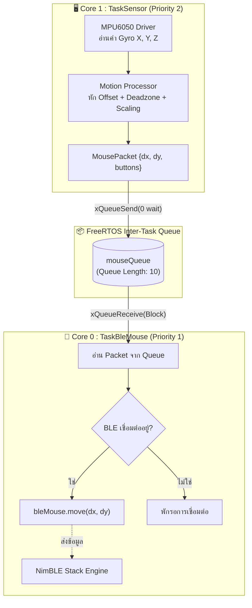

# 🧤 ESP32 + MPU6050 Glove Air Mouse (FreeRTOS Dual-Core)

โปรเจกต์พัฒนาระบบควบคุมเคอร์เซอร์เมาส์ไร้สายแบบสวมมือ (Air Mouse Glove) ผ่าน Bluetooth Low Energy (BLE HID) โดยใช้ไมโครคอนโทรลเลอร์ **ESP32** ร่วมกับเซนเซอร์วัดความเคลื่อนไหว **MPU6050** บนสถาปัตยกรรม **FreeRTOS Dual-Core**

---

## 📌 สารบัญ (Table of Contents)
1. [ภาพรวมของระบบ (Overview)](#-ภาพรวมของระบบ-overview)
2. [สถาปัตยกรรม FreeRTOS Dual-Core](#-สถาปัตยกรรม-freertos-dual-core)
3. [การเชื่อมต่อฮาร์ดแวร์ (Hardware Pinout)](#-การเชื่อมต่อฮาร์ดแวร์-hardware-pinout)
4. [หลักการประมวลผลการเคลื่อนไหว (Motion Processing Pipeline)](#-หลักการประมวลผลการเคลื่อนไหว-motion-processing-pipeline)
5. [โครงสร้างไฟล์และแนวทางการอ่านโค้ด (Codebase Structure)](#-โครงสร้างไฟล์และแนวทางการอ่านโค้ด-codebase-structure)
6. [คู่มือการติดตั้งและการใช้งาน (Setup & Usage)](#-คู่มือการติดตั้งและการใช้งาน-setup--usage)
7. [การปรับจูนพารามิเตอร์ (Tuning Parameters)](#-การปรับจูนพารามิเตอร์-tuning-parameters)
8. [แผนการต่อยอดในอนาคต (Roadmap)](#-แผนการต่อยอดในอนาคต-roadmap)

---

## 🚀 ภาพรวมของระบบ (Overview)

โปรเจกต์นี้เปลี่ยนการเคลื่อนไหวของข้อมือในอากาศให้กลายเป็นการเคลื่อนที่ของเคอร์เซอร์เมาส์บนหน้าจอคอมพิวเตอร์อย่างเป็นธรรมชาติ:
* **Gyroscope Mode:** ใช้ความเร็วเชิงมุม (Angular Velocity: rad/s) ของการหมุนข้อมือในการเลื่อนเคอร์เซอร์ ขยับเร็วเมาส์ไปเร็ว ขยับช้าเมาส์ไปช้า และหยุดนิ่งทันทีเมื่อข้อมืออยู่นิ่ง
* **Direct I2C Driver:** พัฒนาไดรเวอร์ติดต่อกับ MPU6050 ด้วยรีจิสเตอร์โดยตรง ไม่พึ่งพาไลบรารีภายนอกที่ติดปัญหาล็อค Device ID ทำให้รองรับชิป MPU6050 และ Revision ทุกเกรดในท้องตลาด 100%
* **Bluetooth BLE HID:** จำลองตัวเป็นเมาส์มาตรฐาน ทำงานได้กับ Windows, macOS, Linux, และ Android โดยไม่ต้องลงไดรเวอร์เสริมที่คอมพิวเตอร์

---

## 🧠 สถาปัตยกรรม FreeRTOS Dual-Core

ระบบถูกออกแบบให้ใช้ขุมพลัง **2 แกนสมอง (Dual-Core)** ของชิป ESP32 อย่างเต็มประสิทธิภาพ โดยแยกงานที่มีความสำคัญด้านเวลา (Time-critical) ออกจากงานสื่อสารไร้สาย (Wireless Stack):



### รายละเอียดของแต่ละ Task:
1. **`TaskSensor` (Core 1):**
   * ทำงานด้วยรอบเวลาที่แม่นยำสูงระดับฮาร์ดแวร์ผ่าน `vTaskDelayUntil()` ทุก **10ms (100 Hz)**
   * อ่านค่าเชิงมุม $\rightarrow$ ลบ Drift Offset $\rightarrow$ กรองการสั่น $\rightarrow$ แพ็กเป็น `MousePacket` แล้วส่งเข้า Queue
   * รับประกันว่าการอ่านเซนเซอร์จะไม่สะดุด แม้ระบบบลูทูธจะมีช่วงดีเลย์
2. **`TaskBleMouse` (Core 0):**
   * ทำงานร่วมกับแกนประมวลผล Bluetooth ภายในของ ESP32
   * ใช้คำสั่ง `xQueueReceive()` แบบบล็อกรอ (`portMAX_DELAY`) คือถ้าไม่มีข้อมูลในคิว Task จะหลับไปทันที (0% CPU Usage) และตื่นขึ้นมาทำงานทันทีที่มีข้อมูลเข้ามา (Event-driven)

---

## 🔌 การเชื่อมต่อฮาร์ดแวร์ (Hardware Pinout)

การต่อวงจรระหว่างบอร์ด **ESP32 (30-pin DevKit)** กับโมดูล **MPU6050 (GY-521)**:

| ขา MPU6050 | ขา ESP32 | คำอธิบาย |
|:---:|:---:|---|
| **VCC** | **3.3V หรือ 5V** | หากเป็นโมดูล GY-521 ที่มีชิปเรกูเลเตอร์ 3.3V ในตัว แนะนำต่อ 5V |
| **GND** | **GND** | กราวด์ร่วมของระบบ |
| **SDA** | **GPIO 21** | I2C Data Line (มีระบบดึงสัญญาณที่ 400 kHz) |
| **SCL** | **GPIO 22** | I2C Clock Line |
| **AD0** | **GND** | กำหนดให้ Address หลักเป็น `0x68` (หากลอยไว้หรือต่อไฟจะเป็น `0x69`) |
| **INT** | **GPIO 4** | ส่งสัญญาณ Data Ready เพื่อปลุก TaskSensor ทุกครั้งที่ข้อมูลใหม่พร้อมอ่าน |

การต่อจอ **OLED SH1106 แบบ I2C ขนาด 128x64** (ใช้บัสเดียวกับ MPU6050):

| ขา OLED | ขา ESP32 | คำอธิบาย |
|:---:|:---:|---|
| **VCC** | **3.3V** | ใช้ 3.3V เพื่อให้ pull-up ของ I2C ไม่เกินระดับสัญญาณ ESP32 |
| **GND** | **GND** | กราวด์ร่วม |
| **SDA** | **GPIO 21** | แชร์กับ SDA ของ MPU6050 |
| **SCL** | **GPIO 22** | แชร์กับ SCL ของ MPU6050 |

OLED จะลอง I2C address `0x3C` ก่อน แล้วลอง `0x3D` อัตโนมัติ (datasheet บางรุ่นเขียนเป็น 8-bit write address `0x78` และ `0x7A` ตามลำดับ) และจะแสดง `Calibrating...` ระหว่างเริ่มต้น จากนั้นแสดงสถานะ BLE, host ที่ active, ค่า movement X/Y ล่าสุด และสถานะคลิกซ้าย/ขวา

---

## 📐 หลักการประมวลผลการเคลื่อนไหว (Motion Processing Pipeline)

ขั้นตอนการแปลงสัญญาณความเร็วเชิงมุมจาก MPU6050 เป็นระยะขยับของเคอร์เซอร์บนหน้าจอ:

```
[Raw Gyro LSB] 
      │
      ▼  (หาร 65.5 และคูณ DEG_TO_RAD)
[Angular Velocity (rad/s)]
      │
      ▼  (หักลบ Offset จากการ Calibrate)
[Calibrated Velocity (velX, velY)]
      │
      ▼  (ตรวจเงื่อนไข |vel| < DEADZONE -> เซ็ตเป็น 0)
[Deadzoned Velocity]
      │
      ▼  (คูณ SENSITIVITY_X / Y)
[Scaled Delta Pixels]
      │
      ▼  (กลับด้านแกนตาม INVERT_X / Y)
[Inverted Delta]
      │
      ▼  (จำกัดช่วงด้วย constrain(-127, 127))
[Clamped int8_t dx, dy] -> ส่งต่อไปยัง BLE HID
```

1. **Auto-Calibration:** ตอนเปิดระบบจะเก็บข้อมูล 200 ตัวอย่างตอนมือนิ่ง เพื่อหาค่า Drift ประจำตัวของชิป แล้วนำมาหักลบออก
2. **Deadzone Filter:** ตัดการสั่นไหวขนาดเล็กของมือขณะพยายามอยู่นิ่ง (ค่ามาตรฐาน: `0.06 rad/s`)
3. **Axis Mapping:**
   * **เลื่อนแนวนอน (X บนจอ):** ใช้การบิดข้อมือซ้าย-ขวาในแนวราบ (Yaw: แกน **Z**)
   * **เลื่อนแนวตั้ง (Y บนจอ):** ใช้การกระดกข้อมือก้ม-เงย (Pitch: แกน **Y**)
4. **Clamping Safety:** ป้องกันตัวเลขล้นประเภทข้อมูล `int8_t` ของมาตรฐาน HID Mouse ด้วยคำสั่ง `constrain()`

---

## 📂 โครงสร้างไฟล์และแนวทางการอ่านโค้ด (Codebase Structure)

เพื่อความเข้าใจในการพัฒนา แนะนำให้อ่านไฟล์เรียงตามลำดับ 5 ขั้นตอนดังนี้:

| ลำดับ | ไฟล์ | หน้าที่และความรับผิดชอบ |
|:---:|---|---|
| **1** | [`Config.h`](file:///c:/Users/pingp/Arduino/GloveMouse/Config.h) | **จุดรวมการตั้งค่าทั้งหมด:** พิน I2C, ความไวเมาส์, Deadzone, ทิศทางแกน, และพารามิเตอร์ FreeRTOS |
| **2** | [`MouseTypes.h`](file:///c:/Users/pingp/Arduino/GloveMouse/MouseTypes.h) | **โครงสร้างข้อมูล:** ประกาศ struct `MousePacket` ที่ใช้ส่งข้าม Task ผ่าน Queue |
| **3** | [`MPU6050Driver.h`](file:///c:/Users/pingp/Arduino/GloveMouse/MPU6050Driver.h)<br>[`MPU6050Driver.cpp`](file:///c:/Users/pingp/Arduino/GloveMouse/MPU6050Driver.cpp) | **ไดรเวอร์ฮาร์ดแวร์:** สื่อสารกับรีจิสเตอร์ของ MPU6050 โดยตรง, ปลุกชิป, สลับ Address สำรองอัตโนมัติ, และคำนวณ Offset |
| **4** | [`MotionProcessor.h`](file:///c:/Users/pingp/Arduino/GloveMouse/MotionProcessor.h)<br>[`MotionProcessor.cpp`](file:///c:/Users/pingp/Arduino/GloveMouse/MotionProcessor.cpp) | **ระบบคำนวณการเคลื่อนไหว:** รับค่าเชิงมุมดิบมาผ่านฟิลเตอร์ Deadzone และคำนวณออกมาเป็นระยะพิกเซล $dx, dy$ |
| **5** | [`GloveMouse.ino`](file:///c:/Users/pingp/Arduino/GloveMouse/GloveMouse.ino) | **จุดเริ่มต้นระบบ (Main RTOS):** สร้าง Queue, แบ่ง Task ลง Core 0 / Core 1, และสั่งทำงานระบบ |

---

## 🛠️ คู่มือการติดตั้งและการใช้งาน (Setup & Usage)

### 1. ติดตั้งไลบรารีที่จำเป็นใน Arduino IDE
เปิด Arduino IDE ไปที่ **Sketch** $\rightarrow$ **Include Library** $\rightarrow$ **Manage Libraries...**:
1. ติดตั้ง **`NimBLE-Arduino`** (เวอร์ชัน `2.x` โดย `h2zero`; เขียนและตรวจ API กับ `2.5.1`)
2. ติดตั้ง **`Adafruit SH110X`** และ dependency **`Adafruit GFX Library`**
### 2. การตั้งค่าบอร์ด
1. ไปที่เมนู **Tools** $\rightarrow$ **Board** $\rightarrow$ เลือก **ESP32 Dev Module**
2. เลือกพอร์ต COM ที่เชื่อมต่อกับ ESP32

### 3. การอัปโหลดและการเชื่อมต่อ
1. กดปุ่ม **Upload**
2. เปิด **Serial Monitor** (ตั้งค่า Baud rate: `115200`)
3. **วางถุงมือ/เซนเซอร์ให้นิ่งประมาณ 2 วินาที** ขณะระบบขึ้นข้อความ `[CALIBRATION]`
4. เปิด Bluetooth บนคอมพิวเตอร์ $\rightarrow$ เลือกค้นหาอุปกรณ์ใหม่ $\rightarrow$ เลือกเชื่อมต่อกับ **"Glove Air Mouse"**
5. เมื่อเชื่อมต่อสำเร็จ สามารถเริ่มขยับมือเพื่อควบคุมเมาส์ได้ทันที

### 4. ต่อ 2 เครื่องและสลับเครื่อง
- ถุงมือต่อได้พร้อมกัน 2 เครื่อง: pair เครื่องที่สองด้วยวิธีเดียวกับข้อ 3 (ถุงมือยัง advertise ต่อเนื่อง)
- เครื่องที่ต่อก่อนเป็น **A** เครื่องถัดไปเป็น **B** (ดู Serial Monitor `Active: A/B`)
- ควบคุมด้วย **capacitive touch ที่ GPIO 27 (T7)** (แตะ = ค่า `touchRead` ต่ำกว่า `TOUCH_THRESHOLD` = 700):
  - แตะ **1 ครั้ง** = สลับ ทำงาน ↔ หยุด (ตอนหยุดจะปล่อยปุ่มคลิกที่ค้าง แล้วไม่ส่งข้อมูลเมาส์)
  - แตะ **2 ครั้ง** = สลับเครื่อง A ↔ B (สถานะทำงาน/หยุดคงเดิม)
  - ตรวจจำนวนครั้งด้วยหน้าต่าง 400 ms ดังนั้นแตะครั้งเดียวจะตอบสนองหลังจากนั้นเล็กน้อย
  - ทดสอบ/ปรับค่า: พิมพ์ `t` ใน Serial Monitor ดูค่า `touchRead` ตอนแตะและไม่แตะ แล้วปรับ `TOUCH_THRESHOLD` ใน `Config.h`; พิมพ์ `s` = เหมือนแตะ 2 ครั้ง
- ถ้าเครื่องที่ active หลุด จะย้ายไปอีกเครื่องเองอัตโนมัติ
- ถ้าเคย pair ชื่อ "Glove Air Mouse" ไว้ด้วยไลบรารีเดิม ให้ลบอุปกรณ์ออกจาก Windows ก่อน pair ใหม่
- **อย่าเปิด "Erase All Flash Before Sketch Upload" ใน Arduino IDE ตอนอัปโหลดตามปกติ** (ต้องเป็น Disabled): ตัวเลือกนี้ล้างคีย์ bond ในบอร์ดทุกครั้งที่ flash ทำให้ Windows ที่ยังจำคีย์เดิมต่อแล้วถูกตัดทันทีวนซ้ำ ต้องลบอุปกรณ์แล้ว pair ใหม่ทุกรอบ
- ถ้าต่อไม่เสถียร ดู Serial Monitor: `❌ ... หลุด (reason N: ...)` บอกว่าใครตัดหรือสัญญาณหาย (520 = สัญญาณหาย, 531 = เครื่องที่ต่อตัด, 534 = ESP32 ตัด, 573 = key เข้ารหัสไม่ตรง ให้ลบอุปกรณ์แล้ว pair ใหม่), `📶 ... interval=...` คือ interval จริงของแต่ละเครื่อง, บอร์ดตรวจและเริ่ม advertise ใหม่เองถ้าหยุด, ปฏิเสธเครื่องที่ 3 เพื่อไม่ให้กินช่อง

### 5. Clipboard Service (ฝาก/ขอข้อความผ่าน ESP32)
Custom GATT service แยกจาก HID (ไม่บังคับเข้ารหัส ใครที่ต่อ BLE เข้าบอร์ดได้จะอ่าน/เขียนข้อความได้). ข้อความเก็บในแรมได้ 1 ก้อน ≤ 16384 ไบต์ และถูกล้างเองหลัง 60 วินาที. ถ้า Windows ไม่เห็น service ใหม่ให้ลบอุปกรณ์แล้ว pair ใหม่ (Windows แคช GATT)

| Characteristic | UUID | ทิศ |
|---|---|---|
| Service | `7d3c0001-9a4e-4f6b-8c21-5b6e1f0a9d10` | |
| `CLIP_RX` | `7d3c0002-…` | เครื่อง → ESP32 (write) |
| `CLIP_TX` | `7d3c0003-…` | ESP32 → เครื่อง (notify) |
| `CLIP_STATUS` | `7d3c0004-…` | read/notify: `[state u8][len u16]` (0=ว่าง, 1=มีข้อความ, 2=กำลังรับ) |

Packet: `[type u8][msgId u8][seq u16 LE][payload]`

| type | ความหมาย | payload |
|---|---|---|
| `0x01` START | เริ่มข้อความ | `totalLen u16` + `crc32 u32` (CRC-32 ของ UTF-8 ทั้งก้อน เท่ากับ `zlib.crc32`) |
| `0x02` DATA | ชิ้นข้อมูล (`seq` เริ่ม 0) | ไบต์ข้อความ |
| `0x03` END | จบข้อความ → ESP32 ตรวจความยาว + CRC | - |
| `0x10` ACK / `0x11` NACK | ตอบรับ (ส่งกลับทาง TX) | NACK: error `u8` (1=ใหญ่เกิน 2=ลำดับผิด/ชิ้นไม่ครบ 3=CRC ผิด 4=หมดเวลา 5=สถานะไม่ถูก 6=ว่าง) |
| `0x20` GET | ขอข้อความที่เก็บอยู่ → ESP32 ส่ง START/DATA/END กลับทาง TX | - |
| `0x21` CLEAR | ล้างข้อความ | - |

ขนาดชิ้นต่อ MTU: `MTU − 3 − 4` (16-240 ไบต์). ฝั่งคอมใช้โปรแกรมใน [`companion/`](companion/README.md)

---

## ⚙️ การปรับจูนพารามิเตอร์ (Tuning Parameters)

สามารถปรับจูนความรู้สึกในการใช้งานได้ง่ายๆ ผ่านไฟล์ [`Config.h`](file:///c:/Users/pingp/Arduino/GloveMouse/Config.h):

```cpp
// ปรับความเร็วของเคอร์เซอร์ (ยิ่งมากยิ่งเร็ว)
constexpr float SENSITIVITY_X = 250.0f;  // ที่ sample rate 100 Hz
constexpr float SENSITIVITY_Y = 250.0f;

// ปรับค่าตัดอาการมือสั่น (ถ้าเคอร์เซอร์ยังกระตุกตอนอยู่นิ่ง ให้เพิ่มค่านี้ เช่น 0.08 - 0.10)
constexpr float DEADZONE = 0.06f;

// สลับทิศทางหากเคอร์เซอร์เลื่อนตรงข้ามกับมือ
constexpr bool INVERT_X = false; // true = สลับซ้าย-ขวา
constexpr bool INVERT_Y = true;  // true = สลับขึ้น-ลง
```

---

## 🗺️ แผนการต่อยอดในอนาคต (Roadmap)

โครงสร้างโค้ดแบบ FreeRTOS ปัจจุบันถูกเตรียมพร้อมสำหรับการเพิ่มฟังก์ชันเหล่านี้ได้ทันที:
* [ ] **Clutch Switch (ปุ่มตัดการทำงานชั่วคราว):** ปิดการส่งค่าชั่วคราวเพื่อให้ผู้ใช้สามารถยกมือกลับมาตำแหน่งตั้งต้นได้
* [ ] **Flex Sensors (ตรวจจับการงอนิ้ว):**
  * นิ้วชี้งอ $\rightarrow$ คลิกซ้าย (Left Click)
  * นิ้วกลางงอ $\rightarrow$ คลิกขวา (Right Click)
* [ ] **Gesture Recognition:** ตรวจจับท่าทางการสะบัดมือสำหรับการ Scroll หรือ Back / Forward หน้าเว็บ
* [ ] **Battery Management:** อ่านระดับแรงดันแบตเตอรี่แล้วรายงานกลับไปยังคอมพิวเตอร์ผ่าน BLE HID Battery Service
